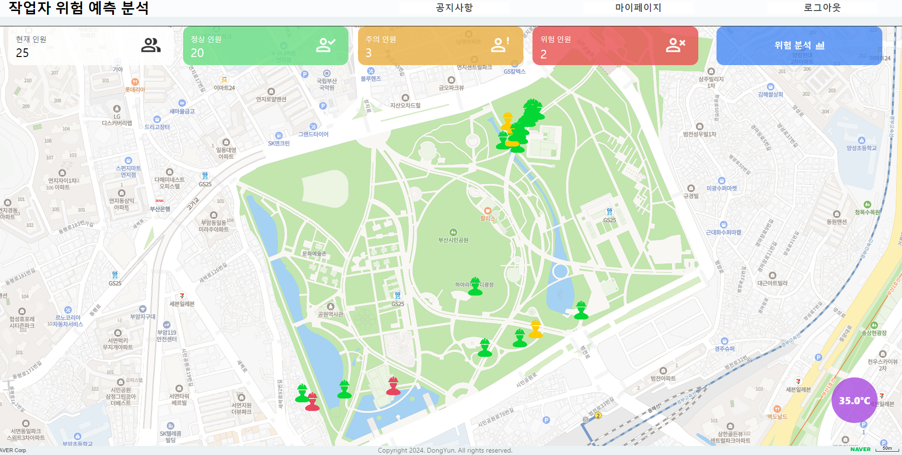
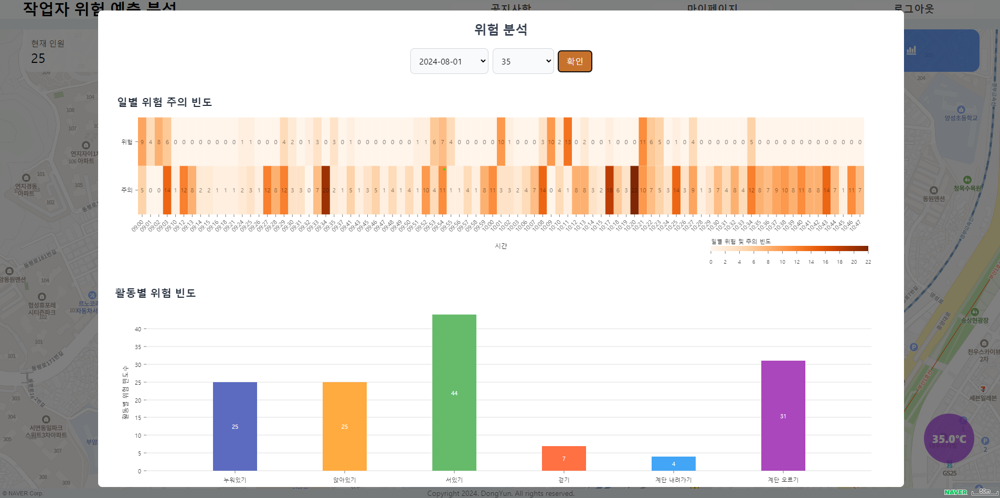
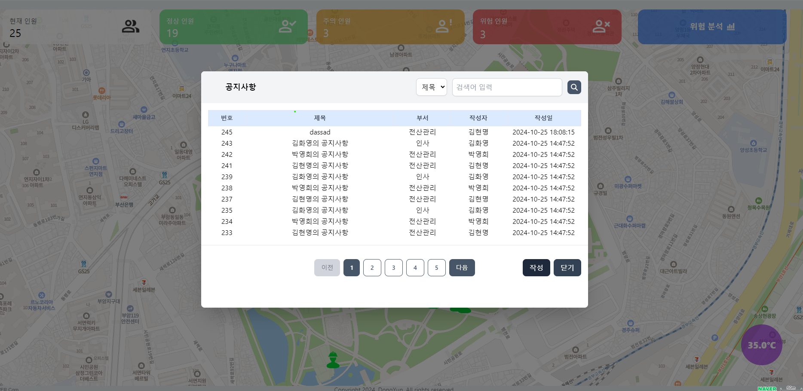
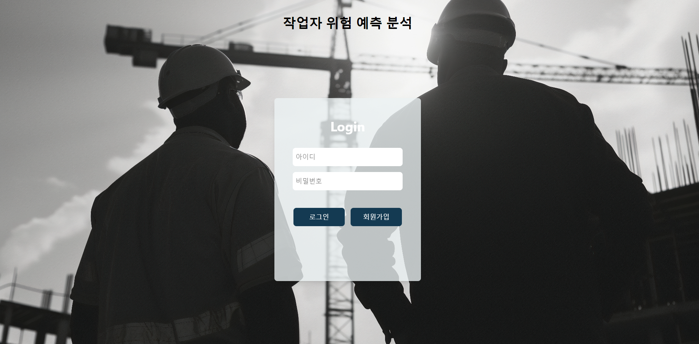
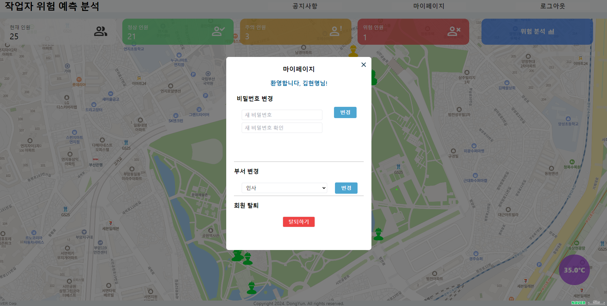

   
  
   
  <h1>프로젝트 제목</h1>
  
   

## 목차

1. **웹 서비스 소개**
2. **기술 스택**
3. **주요 기능**
4. **주요 페이지**
5. **개발 일정**
6. **실행 방법**

 

## 💁🏻‍♂ 웹 서비스 소개

&nbsp;&nbsp;웨어러블 디바이스를 통해 작업자의 생체 신호 및 환경 데이터를 실시간으로 분석하여 
&nbsp;&nbsp;위험을 예측하는 웹서비스 구현

 

[**🔗 배포된 웹 서비스로 바로가기 Click !**](http://58.235.21.221:3000/) 👈

> 새 창 열기 방법 : CTRL+click (on Windows and Linux) | CMD+click (on MacOS)

 

## 🛠 기술 스택

**Front-end**

-   
- 

**Back-end**

- 
- 
- 
- 

**ETC**

-  

 

## 💡 주요 기능
<table>
  <tr>
    <td align="center">
      
       
      작업자 실시간 모니터링
    </td>
    <td align="center">
      
       
      위험 예측 분석 대시보드
    </td>
  </tr>
  <tr>
    <td align="center">
      
       
      공지사항
    </td>
    <td align="center">
      
       
      로그인/회원가입
    </td>
  </tr>
  <tr>
    <td align="center">
      
       
      마이페이지
    </td>
  </tr>
</table>

 

