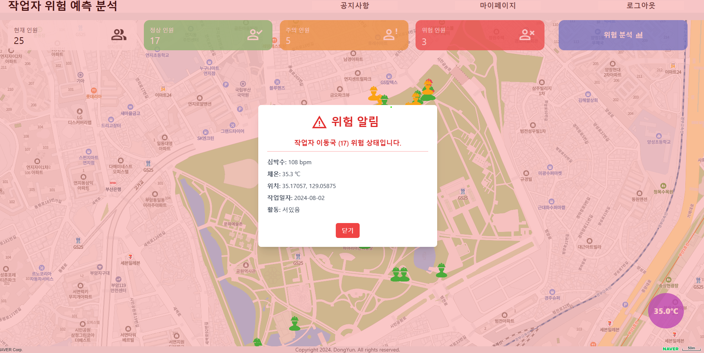

  <h1>작업자 위험 예측 분석 웹 서비스</h1>
   
  
   
  
   

## 목차

1. **웹 서비스 소개**
2. **기술 스택**
3. **주요 기능**

 

## 💁🏻‍♂ 웹 서비스 소개

- 웨어러블 디바이스를 통해 작업자의 생체 신호 및 환경 데이터 수집 
- 수집된 데이터를 실시간으로 분석해 위험을 예측하는 SPA 웹 서비스 구현

 

[**🔗 배포된 웹 서비스로 바로가기 Click !**](http://58.235.21.221:3000/) 👈

> 새 창 열기 방법 : CTRL+click (on Windows and Linux) | CMD+click (on MacOS)

 

## 🛠 기술 스택

**Front-end**

-  

**Back-end**

-  
-  
-  
- ![MySQL](https://img.shi능</li>
      </ul>
    </td>
  </tr>
  <tr>
    <td align="center">
      
       
      <strong style="display: block;">위험 알림</strong>
    </td>
    <td style="vertical-align: top; padding-left: 20px;">
      <ul>
        <li>실시간 위험 예측 데이터를 기반으로 위험 알림 시각화</li>
      </ul>
    </td>
  </tr>
</table>

 
