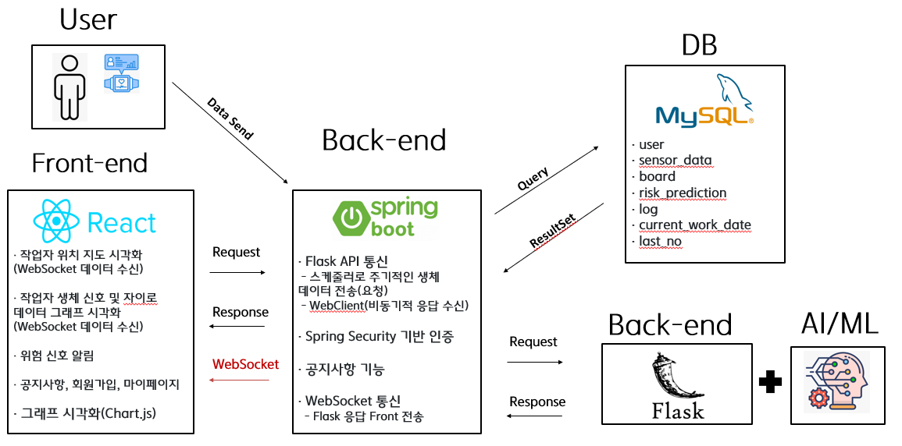
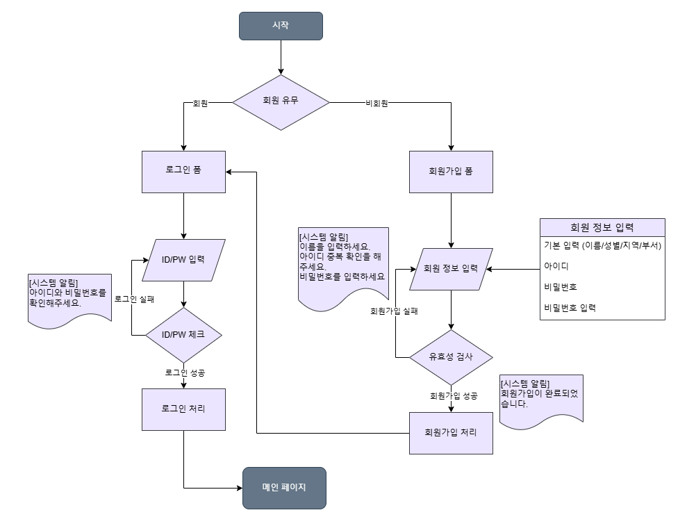
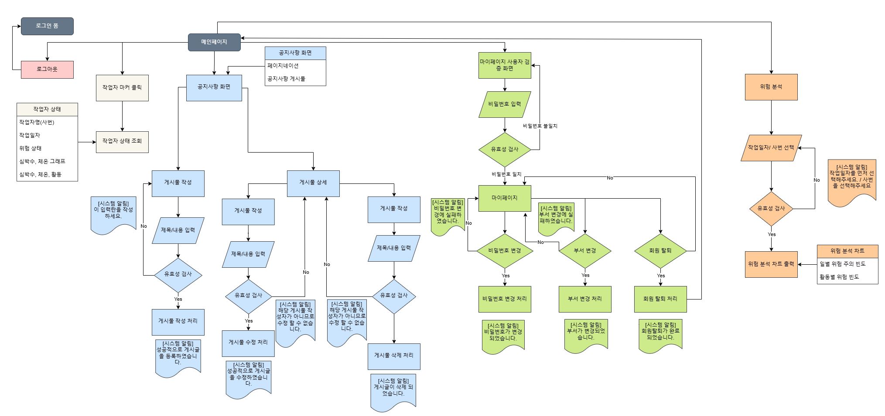
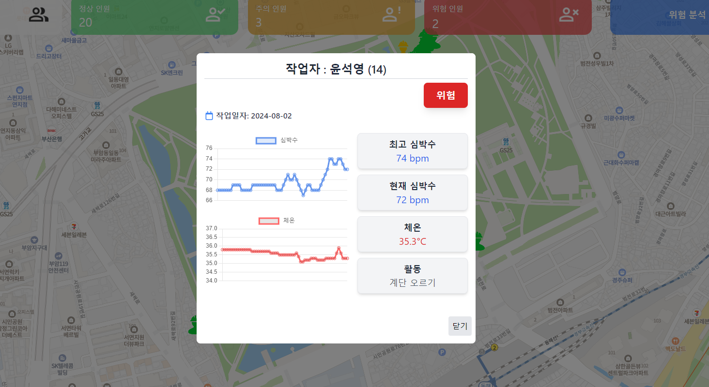

  <h2>작업자 위험 예측 분석 웹 서비스 (2024.08.23 ~ 2024.10.08)</h2>
   
  
   
  
   

## 목차
0. **팀원 구성**
1. **웹 서비스 소개**
2. **시스템 아키텍처**
3. **플로우차트**
4. **기술 스택**
5. **주요 기능**
6. **구현 중 어려웠던 점 및 해결방법** 

 

## 🤝 팀원 구성

- **문동윤**: 백엔드 개발
- **이창수**: 프론트엔드 개발
- **박동헌**: 데이터 분석

 

## 💁🏻‍♂ 웹 서비스 소개 

- 웨어러블 디바이스를 통해 작업자의 생체 신호 및 환경 데이터 수집 
- 수집된 데이터를 실시간으로 분석해 위험을 예측하는 SPA 웹 서비스 구현

 

[**🔗 배포된 웹 서비스로 바로가기 Click !**](http://58.235.21.221:3000/) 👈

> 새 창 열기 방법 : CTRL+click (on Windows and Linux) | CMD+click (on MacOS)

 

## 🏗️ 시스템 아키텍처

 

## 📈 플로우차트 (Flowchart)

  <h4>로그인/회원가입</h4>
  

  <h4>메인페이지</h4>
  

 

## 🛠 기술 스택

**Front-end**

-  
-  
-  

**Back-end**
-  
-  
-  
-  
-  

**AI/ML**

-  
-  

**ETC**

-  

 

## 💡 주요 기능
**👉 이미지를 클릭하면 기능 구현 영상을 볼 수 있습니다.**
<table style="width: 100%;">
  <tr>
    <td align="center">
      
       
      <strong style="display: block;">로그인/회원가입</strong>
    </td>
    <td style="vertical-align: top; padding-left: 20px;">
      <ul>
        <li>회원가입 아이디 중복 확인 및 비밀번호 검증</li>
        <li>로그인, 로그아웃 시 JWT 토큰 생성 또는 제거</li>
      </ul>
    </td>
  </tr>
  <tr>
    <td align="center">
      
       
      <strong style="display: block;">작업자 실시간 모니터링</strong>
    </td>
    <td style="vertical-align: top; padding-left: 20px;">
      <ul>
        <li>위험 예측, 생체 데이터 및 위치 정보 실시간 수신</li>
        <li>작업자 상태와 위험도를 시각적으로 표시</li>
        <li>외부 온도 정보 실시간 업데이트</li>
        <li>작업자 위치를 지도에 표시</li>
      </ul>
    </td>
  </tr>
  <tr>
    <td align="center">
      
       
      <strong style="display: block;">위험 예측 분석 대시보드</strong>
    </td>
    <td style="vertical-align: top; padding-left: 20px;">
      <ul>
        <li>일자별, 작업자별 위험 예측 데이터 시각화</li>
        <li>특정 작업자의 해당일자의 시간대별 위험 주의 빈도</li>
        <li>활동별 위험 빈도</li>
      </ul>
    </td>
  </tr>
  <tr>
    <td align="center">
      
       
      <strong style="display: block;">공지사항</strong>
    </td>
    <td style="vertical-align: top; padding-left: 20px;">
      <ul>
        <li>게시물 검색, 글쓰기, 수정, 삭제</li>
        <li>게시판 페이지네이션</li>
      </ul>
    </td>
  </tr>
  <tr>
    <td align="center">
      
       
      <strong style="display: block;">마이페이지</strong>
    </td>
    <td style="vertical-align: top; padding-left: 20px;">
      <ul>
        <li>마이페이지 접 시 비밀번호 검증</li>
        <li>비밀번호 및 부서 변경 기능</li>
        <li>회원탈퇴 기능</li>
      </ul>
    </td>
  </tr>
  <tr>
    <td align="center">
      
       
      <strong style="display: block;">위험 알림</strong>
    </td>
    <td style="vertical-align: top; padding-left: 20px;">
      <ul>
        <li>실시간 위험 예측 데이터를 기반으로 위험 알림 시각화</li>
      </ul>
    </td>
  </tr>
</table>

 

## 🔧 구현 중 어려웠던 점 및 해결방법
**동기→비동기 전환:** 
1. RestTemplate을 사용하여 동기식으로 분석 모델에 데이터를 전송할 때 문제가 발생. 
2. 분석 모델은 일정량의 데이터가 쌓여야만 분석이 가능했지만, 동기식 요청에서는 원하는 결과를 얻을 수 없었음.
3. 이후 WebClient를 사용하여 비동기 방식으로 요청을 전송해 필요한 데이터가 쌓일 수 있게 했고, 분석된 결과는 WebSocket을 통해 실시간으로 프론트엔드에 전달할 수 있었음.
   
